# 📬 IdentityMail

**IdentityMail**, kurum içi iletişim senaryosu üzerine geliştirilmiş, rol tabanlı yetkilendirme ve yönetim özelliklerine sahip bir **ASP.NET Core MVC mesajlaşma uygulamasıdır**.

Uygulama; kullanıcıların mesajlaşma süreçlerini yönetmesine, mesajları filtrelemesine, şüpheli içerikleri bildirmesine ve yöneticilerin kullanıcı, rol, şikayet ve şifre sıfırlama süreçlerini merkezi olarak yönetmesine olanak sağlar.

---

## ✨ Özellikler

### 📩 Mesaj Yönetimi

- Gelen kutusu ve gönderilen mesajlar
- Yeni mesaj gönderme ve yanıtlama
- Taslak oluşturma ve düzenleme
- Önemli mesaj yönetimi
- Çöp kutusu
- Okundu / okunmadı durumu
- Mesaj kategorileri
- Arama, filtreleme ve sıralama

### 🚩 Şikayet Sistemi

- Mesajları yöneticilere bildirme
- Şikayet nedeni ve açıklama ekleme
- Aynı mesaj için tekrar şikayet oluşturulmasının engellenmesi
- Şikayet durumunun kullanıcı tarafından takip edilmesi
- Yönetici tarafından şikayetlerin incelenmesi ve durumlarının güncellenmesi

### 🛡️ Yönetim Paneli

`Admin` rolüne sahip kullanıcılar:

- Kullanıcıları görüntüleyebilir
- Kullanıcı hesaplarını aktif / pasif hale getirebilir
- Sistem rollerini yönetebilir
- Kullanıcılara rol atayabilir veya kaldırabilir
- Mesaj şikayetlerini inceleyebilir
- Şifre sıfırlama taleplerini yönetebilir

---

## 🔐 Kimlik Doğrulama ve Yetkilendirme

Kullanıcı ve rol yönetimi için **ASP.NET Core Identity** kullanılmaktadır.

| Rol | Yetki |
|---|---|
| `User` | Mesajlaşma ve standart kullanıcı işlemleri |
| `Admin` | Standart işlemler + yönetim ve moderasyon işlemleri |

Rol tabanlı yetkilendirme ile yönetim alanlarına erişim kontrol edilmektedir.

Pasif duruma getirilen kullanıcıların sisteme erişimi engellenebilir.

---

## 🔑 Şifre Sıfırlama

Uygulamada kurum içi kullanım senaryosuna yönelik **yönetici kontrollü şifre sıfırlama süreci** bulunmaktadır.

```text
Kullanıcı
   ↓
Şifre Sıfırlama Talebi
   ↓
Admin Paneli
   ↓
Yönetici İncelemesi
   ↓
Yeni / Geçici Parola
   ↓
Talebin Tamamlanması
```

---

## 🛠️ Kullanılan Teknolojiler

| Teknoloji | Kullanım |
|---|---|
| C# | Backend geliştirme |
| ASP.NET Core MVC | Web uygulama altyapısı |
| ASP.NET Core Identity | Authentication & Authorization |
| Entity Framework Core | ORM ve veri erişimi |
| SQL Server | İlişkisel veritabanı |
| Razor Views | Dinamik kullanıcı arayüzleri |
| HTML5 / CSS3 | Arayüz geliştirme |
| Bootstrap Icons | İkon sistemi |

---

## 🏗️ Mimari

Uygulama **ASP.NET Core MVC** mimarisi üzerine geliştirilmiştir.

```text
              User
                │
                ▼
           Razor Views
                │
                ▼
           Controllers
                │
          ┌─────┴─────┐
          ▼           ▼
        DTOs      ASP.NET
                   Identity
          │           │
          └─────┬─────┘
                ▼
      Entity Framework Core
                │
                ▼
           SQL Server
```

---

## 📁 Proje Yapısı

```text
IdentityMailProject/
│
├── IdentityMail.Web/
│   ├── Context/
│   ├── Controllers/
│   ├── CustomValidation/
│   ├── DTOs/
│   ├── Entities/
│   ├── Helpers/
│   ├── Migrations/
│   ├── Models/
│   ├── Views/
│   ├── wwwroot/
│   ├── appsettings.json
│   └── Program.cs
│
├── screenshots/
├── IdentityMailProject.sln
├── .gitignore
└── README.md
```

---

## 🗄️ Veritabanı

Projede **Entity Framework Core Code First** yaklaşımı kullanılmaktadır.

Temel veri yapıları:

- Kullanıcılar ve roller
- Kullanıcı-rol ilişkileri
- Mesajlar
- Mesaj şikayetleri
- Şifre sıfırlama talepleri

Veritabanı şemasındaki değişiklikler **Entity Framework Core Migrations** ile yönetilmektedir.

---

## 🚀 Kurulum

### 1. Repository'yi klonlayın

```bash
git clone <repository-url>
cd IdentityMailProject/IdentityMail.Web
```

### 2. Bağımlılıkları yükleyin

```bash
dotnet restore
```

### 3. Veritabanı bağlantısını yapılandırın

`appsettings.json` içerisindeki connection string değerini kendi SQL Server ortamınıza göre düzenleyin.

```json
{
  "ConnectionStrings": {
    "DefaultConnection": "YOUR_SQL_SERVER_CONNECTION_STRING"
  }
}
```

### 4. Migration'ları uygulayın

```bash
dotnet ef database update
```

### 5. Uygulamayı çalıştırın

```bash
dotnet run
```

---

## ⚙️ Gereksinimler

- .NET SDK
- SQL Server
- Entity Framework Core CLI
- Visual Studio / Visual Studio Code / Rider
- Modern web tarayıcısı

Entity Framework CLI gerekli olması durumunda:

```bash
dotnet tool install --global dotnet-ef
```

---

# 🖼️ Uygulama Ekranları

## 🔐 Giriş

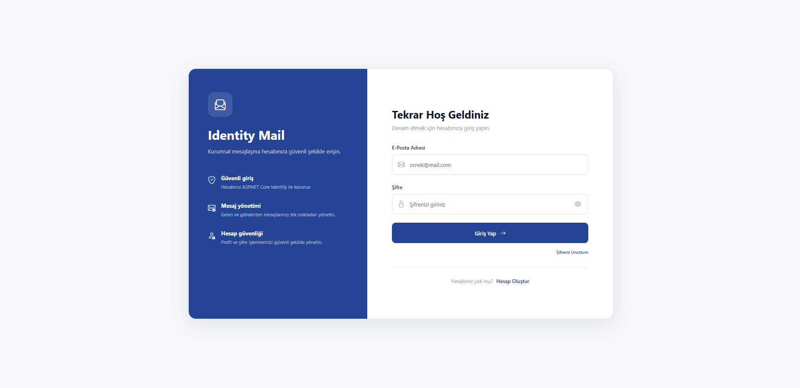

## 📝 Kayıt Ol

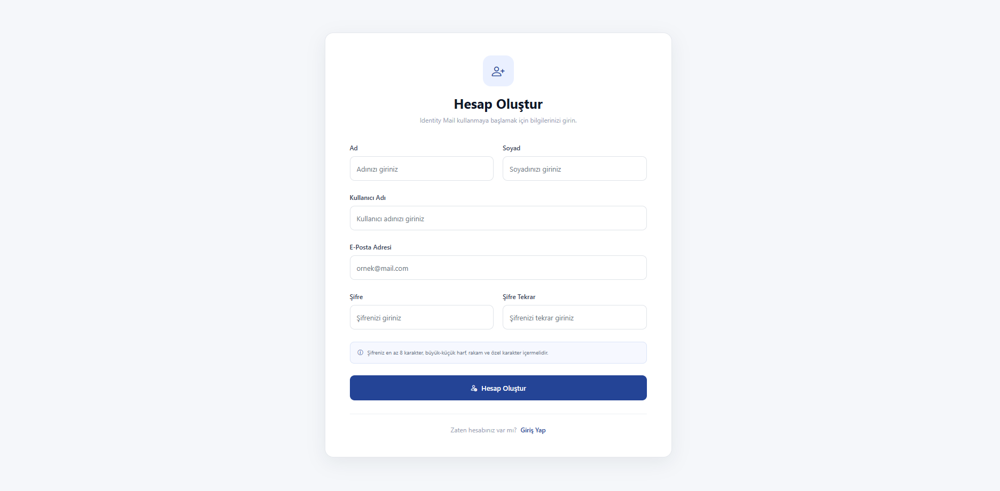

## 🔑 Şifremi Unuttum


## 📥 Gelen Kutusu

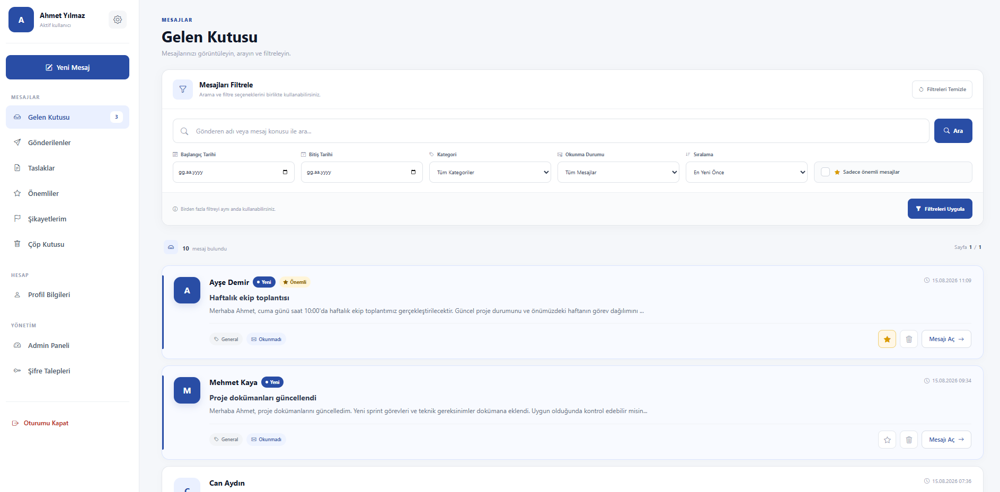

## ✉️ Yeni Mesaj

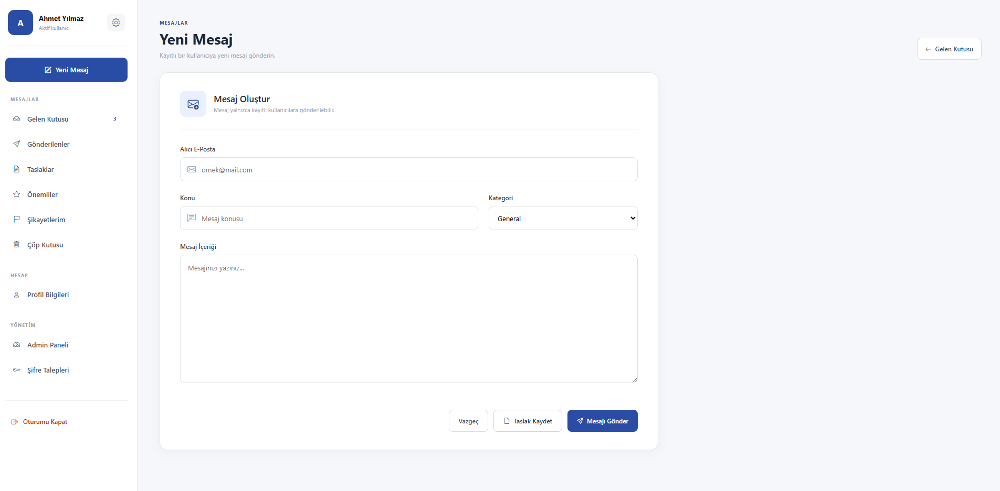

## 📤 Gönderilenler

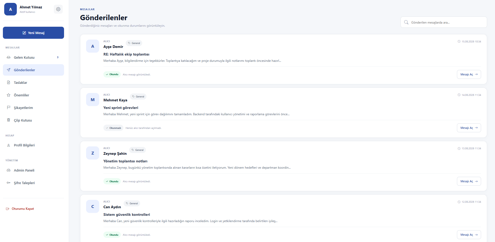

## 📝 Taslaklar

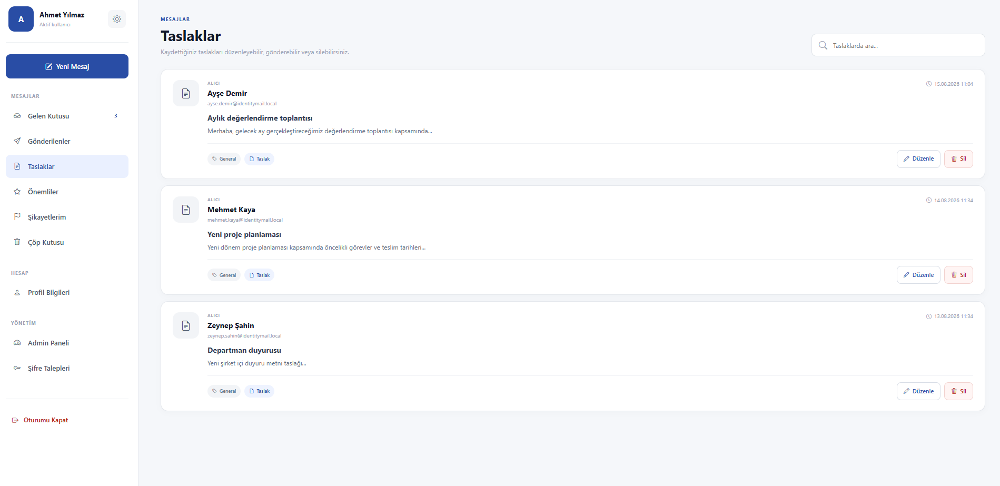

## ⭐ Önemli Mesajlar

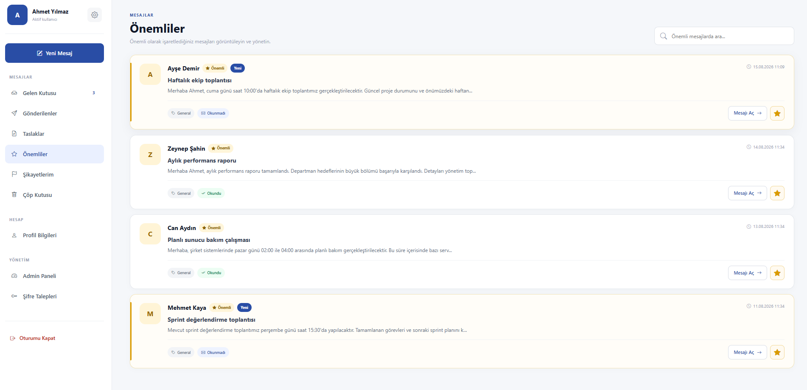

## 🗑️ Çöp Kutusu

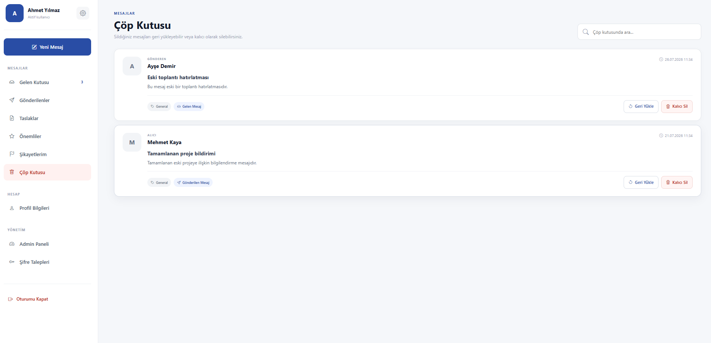

## 📄 Mesaj Detayı

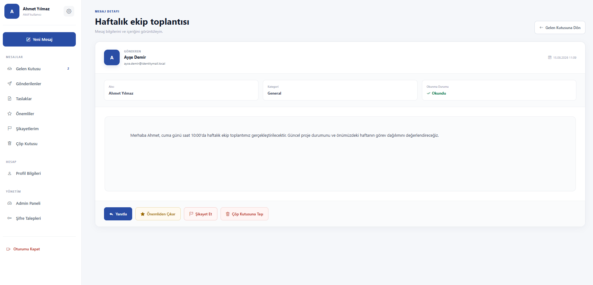

## ↩️ Mesaj Yanıtlama

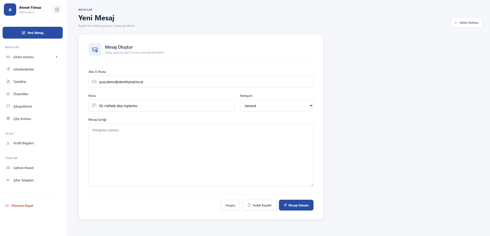

## 🚩 Şikayetlerim

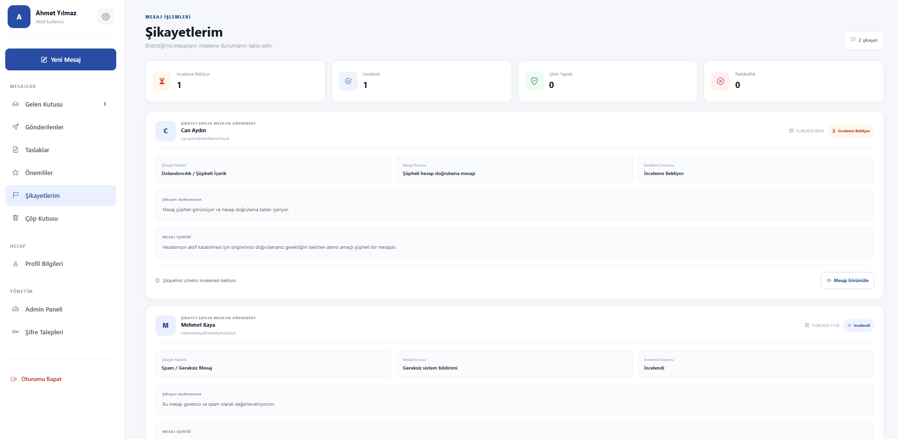

## 👤 Profil Bilgileri

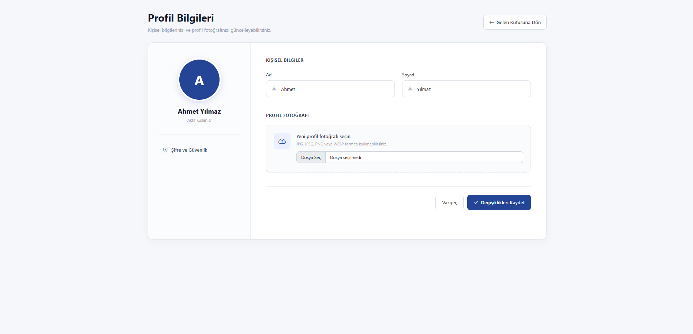

## 🔒 Şifre ve Güvenlik

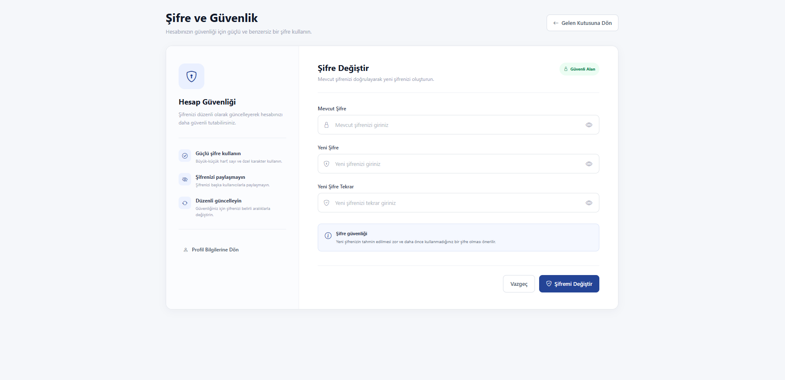

---

# 🛡️ Yönetim Paneli

## 📊 Dashboard

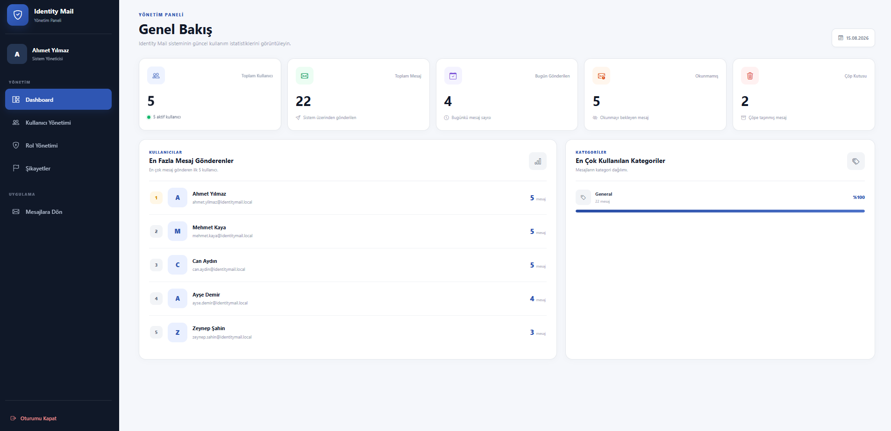

## 👥 Kullanıcı Yönetimi

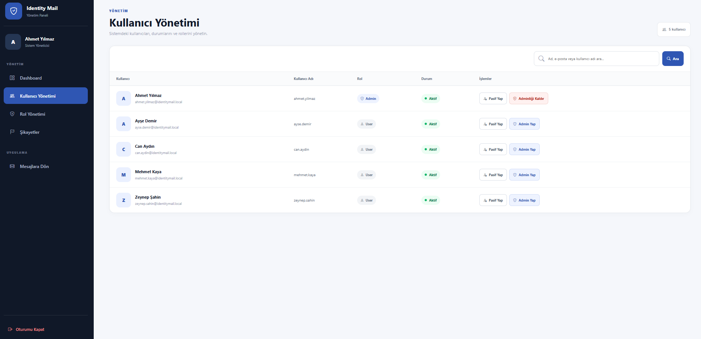

## 🛡️ Rol Yönetimi

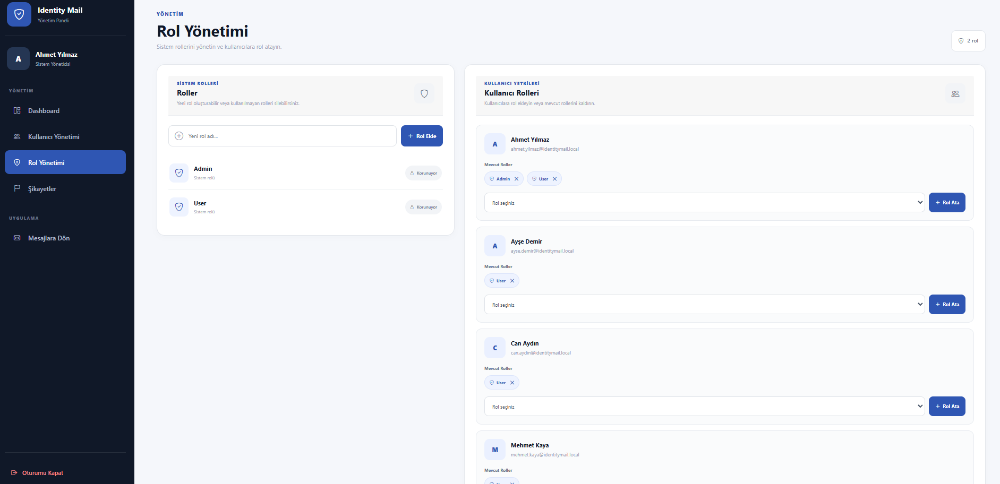

## 🚩 Şikayet Yönetimi

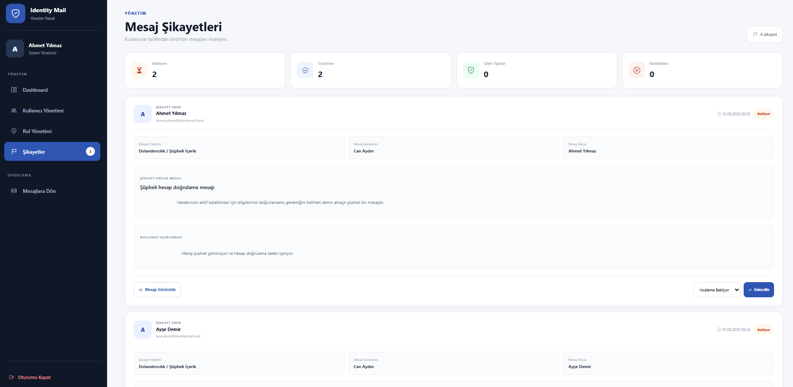

## 🔑 Şifre Sıfırlama Talepleri

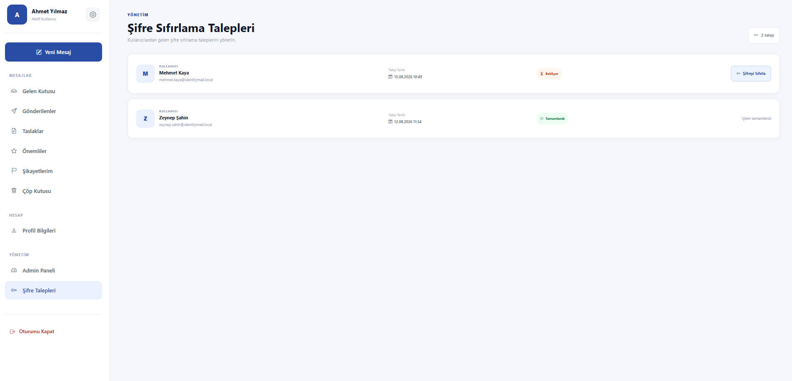

## 🔐 Yönetici Şifre Sıfırlama

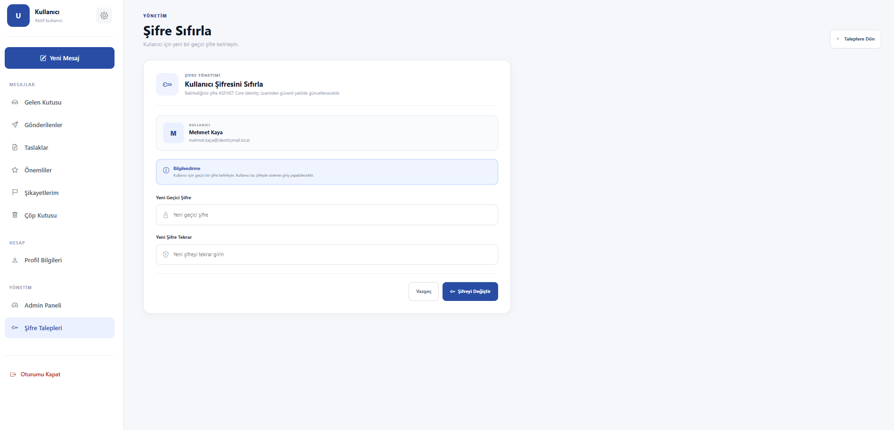

---

## 🔮 Geliştirilebilir Özellikler

- SignalR ile gerçek zamanlı bildirimler
- Dosya ve belge ekleri
- Audit Log sistemi
- LDAP / Active Directory entegrasyonu

---

## 📌 Not

Bu proje, **ASP.NET Core MVC, ASP.NET Core Identity, Entity Framework Core ve SQL Server** teknolojilerinin birlikte kullanıldığı bir mesajlaşma ve yönetim uygulaması olarak geliştirilmiştir.
